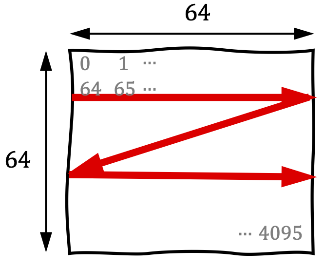
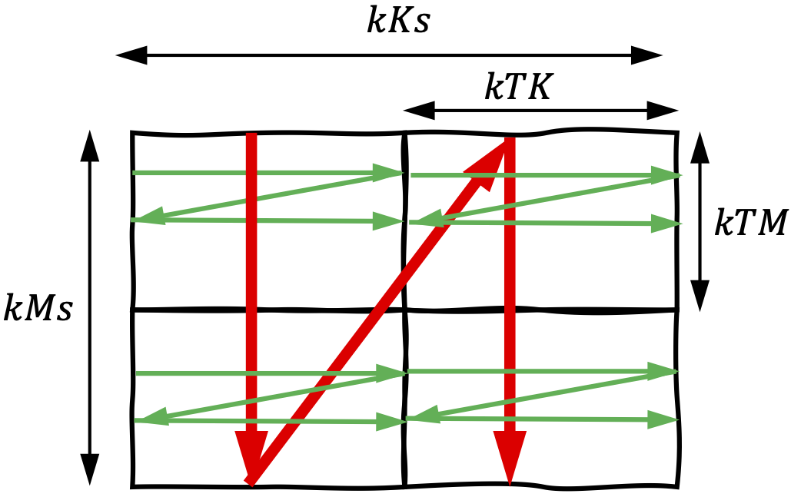
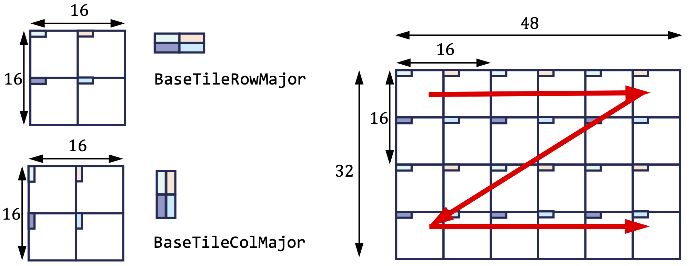
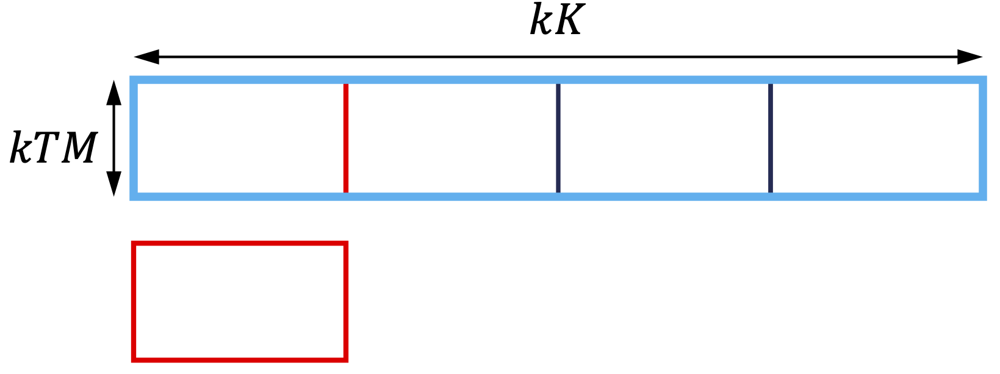
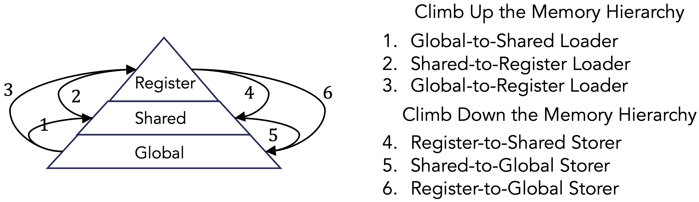

## Types

### Tile

### TileLayout

   
  Fig: The matrix layout used for the global and shared memory tiles.

   
  Fig: The tiled matrix layout used for the shared memory tile.

   
  Fig: The TensorCore register tile layout.

### TileIterator

   
  Fig: Partition tensor using a tile iterator.

## Tile Transfer with Loaders and Storers

   
  Fig: A tile is transferred between memory hierarchies using a loader and a storer.

