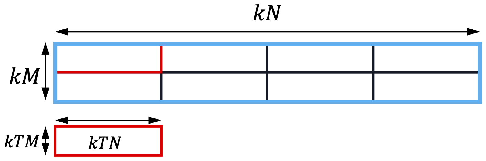

TileFusion operates on four core concepts: `Tile`, `Layout`, `TileIterator`, and `Loader/Storer`, which facilitate the transfer of tiles between memory hierarchies.

## Types

Core types in TileFusion are defined in the [types](https://github.com/microsoft/TileFusion/tree/master/include/types) directory.

### Tile

A tile is a 1D (vector) or 2D (matrix) array that resides within one of the three GPU memory hierarchies. A tile is typically characterized by three attributes:

- **Shape**: The dimensions of the tile, specified by the number of elements along each axis.
- **Layout**: Layout is a parameterized function that maps a tuple of integer coordinates (representing the elements in the tile) to an integer. The lexicographical order of these coordinates can determine the sequence of elements within the tile.
- **ElementType**: The data type of the elements stored in the tile.

Based on the memory hierarchy where a tile resides, there are three different variants: [GlobalTile](https://github.com/microsoft/TileFusion/blob/master/include/types/global.hpp), [SharedTile](https://github.com/microsoft/TileFusion/blob/master/include/types/shared.hpp), and [RegTile](https://github.com/microsoft/TileFusion/blob/master/include/types/register.hpp).

#### Global Memory Tile

A 2D tile in global memory with a shape of $[64, 64]$, a `RowMajor` layout, and a `float` element type can be defined as follows:

```cpp
using Global = GlobalTile<float, RowMajor<64, 64>>;
```

#### Shared Memory Tile

To define an equivalent tile located in shared memory:

```cpp
// `is_swizzled = true` indicates the tile is swizzled in shared memory,
// which is a common practice to enhance shared memory access performance.
// The default value is false, which simplifies debugging.
using Shared = SharedTile<float, RowMajor<64, 64>, is_swizzled=true>;
```

<p class="highlight-note"><span class="note-prefix">Note:</span> Both Global and Shared memory tiles use a RowMajor layout, although their physical memory layouts differ. This difference will be explained in the next section, <a href="https://tiledtensor.github.io/tilefusion-docs/docs/design/core_concepts#tiled-matrix-layout">Tiled Matrix Layout</a>. Users don't need to concern themselves with these details. They only need to know that a shared memory tile is a 2D array with dimensions $[64, 64]$ and a RowMajor layout. The tile primitive will manage the layout automatically.</p>

#### Register File Tile

For tiles located in the register file, the definition differs slightly. In CUDA, registers are thread-local. Consequently, when the aforementioned tile is located in the register file, it is partitioned across threads in the CTA. Therefore, the register tile held by an individual thread is defined as follows:

```cpp
using Reg = RegTile<BaseTileRowMajor<float>, RowMajor<4, 4>>;
```

We will further discuss the second parameter of `RegTile` in the next section: <a href="https://tiledtensor.github.io/tilefusion-docs/docs/design/core_concepts#register-tile-layout">Register Tile Layout</a>.

### Tile Layout

The shape of a tile defines a high-dimensional space, with each coordinate in this space represented by an integer tuple. The layout of a tile is a function that maps this integer tuple to an integer, providing a comprehensive and logical description of data, threads, warps, and other resources.

Given that a GPU's three memory hierarchies favor different access patterns, there are conceptually three types of layouts in TileFusion: **Matrix Layout**, **Tiled Matrix Layout**, and **Register Tile Layout**.

<p class="highlight-note"><span class="note-prefix">Note:</span> These three layouts are inter-composable, but an important simplification we made is that arbitrary nested composability is not supported; composition can be performed only once. This will be explained in the examples below.</p>

#### Matrix Layout

The [matrix layout](https://github.com/microsoft/TileFusion/blob/master/include/types/layout.hpp#L48) is defined by its shape and strides. This layout is utilized for global and shared memory tiles, as well as for specifying the numbering of threads or warps. It is declared as follows:

```cpp
using Layout = MatrixLayout<64 /*Rows*/, 64 /*Columns*/,
                            64 /*Row Stride*/, 1 /*Column Stride*/>;

// layout is a callable function that maps a tuple of integers to an integer
Layout layout;
for (int i = 0; i < 64; ++i) {
    for (int j = 0; j < 64; ++j) {
        int idx = layout(i, j);  // idx = i * row_stride + j * column_stride
    }
}
```

This is equivalent to:

```cpp
using Layout = RowMajor<64, 64>;
```

As illustrated in <a href="#figure-1">Figure 1</a>, the default element order of the above matrix layout follows the conventional row-major format.

<div align="center" id="figure-1">
  <a href="../../assets/images/matrix_layout.png" target="_blank">
    
  </a><br>
  Figure 1: The row-major matrix layout.
</div>
<br>

Similarly, the column-major matrix layout is defined as:

```cpp
using Layout = MatrixLayout<64 /*Rows*/, 64 /*Columns*/,
                            1 /*Row Stride*/, 64 /*Column Stride*/>;
```

This is equivalent to:

```cpp
using Layout = ColMajor<64, 64>;
```

Row-major and column-major layouts are two specializations of the matrix layout.

#### Tiled Matrix Layout

The <span class="text-red">tiled matrix layout is specifically designed for the efficient access of shared memory tiles</span>, and can be understood as a matrix layout composed with another matrix layout in concept.

A shared memory tile with a shape of `[64, 64]` and a `RowMajor` has a tiled matrix layout internally.

```cpp
using Shared = SharedTile<float, RowMajor<64, 64>, is_swizzled=true>;
```

For the shared memory tile mentioned above, <a href="#figure-2">Figure 2</a> demonstrates how data is stored in the tiled matrix layout.

<div align="center" id="figure-2">
  <a href="../../assets/images/tiled_matrix_layout.png" target="_blank">
    
  </a><br>
  Figure 2: The tiled matrix layout used for the shared memory tile.
</div>
<br>

In a tiled matrix layout, the inner matrix is stored in a contiguous block of memory. The outer layout treats each inner matrix as a single element, arranging these elements into another matrix layout.

Specifically, let's revisit the `RowMajor<64, 64>` for shared memory tile declared in the section [Shared Memory Tile](#shared-memory-tile). It represents a matrix layout that is comprised of another matrix layout. For a detailed explanation of the rationale behind this approach, please refer to [Tiles in Shared Memory](https://tiledtensor.github.io/tilefusion-docs/docs/design/tiles_in_shared_memory).

<p class="highlight-note"><span class="note-prefix">Note:</span> Specifically, let's revisit the RowMajor<64, 64> layout for the shared memory tile, as declared in the section <a href="https://tiledtensor.github.io/tilefusion-docs/docs/design/core_concepts#shared-memory-tile">Shared Memory Tile</a>. This layout represents a matrix that is composed of another matrix layout. For a detailed explanation of the rationale behind this approach, please refer to <a href="https://tiledtensor.github.io/tilefusion-docs/docs/design/tiles_in_shared_memory">Tiles in Shared Memory</a>.</p>

#### Register Tile Layout

The <span class="text-red">register tile layout is specifically designed to feed data to TensorCore</span>. Conceptually similar to the tiled matrix layout, it is a depth-two nested array with a `BaseTileMatrixLayout` as the inner layout and a `MatrixLayout` as the outer layout.

Specifically, let's revisit the register tile, as declared in the section [Register File Tile](#register-file-tile). TensorCore's MMA instruction has a hardware-prescribed tile shape and layout for the input operands. We prescribe a $[16, 16]$ basic building block to effectively leverage the MMA instruction. As shown on the left of <a href="#figure-3">Figure 3</a>, a $16 \times 16$ basic tile feeding into the TensorCore is cooperatively held by a single warp. The first thread in the warp holds data in four segments, as indicated by the colors, and so on with the other threads in the warp. For a thread's register tile, `BaseTileRowMajor` and `BaseTileColumnMajor` store these four segments in the single thread's local register file.

<div align="center" id="figure-3">
  <a href="../../assets/images/register_tile_layout.png" target="_blank">
    
  </a><br>
  Figure 3: The TensorCore register tile layout.
</div>
<br>

Register layouts, based on `BaseTileRowMajor` and `BaseTileColumnMajor`, can be conceptualized as a depth-two nested array, with `BaseTileMatrixLayout` as the inner layout and `MatrixLayout` as the outer layout. The register tile depicted in the right part of <a href="#figure-3">Figure 3</a> is equivalent to the following definition:

```cpp
using Reg = RegTile<BaseTileRowMajor<float>, RowMajor<2, 3>>;
```

<p class="highlight-note"><span class="note-prefix">Note:</span>The interface for the register tile is coupled with the declaration of <code>RegisterTile</code> at the current version. The interface for specifying the register tile layout will be refined in the future to align more clearly with the underlying concept. For now, users can safely assume that implementations are guaranteed to follow the above description.</p>

### Tile Iterator

The tile iterator offers syntactic interfaces for defining tile partitions and facilitates tile traversal. Given that global and shared memory have distinct access patterns, there are two variants of tile iterators: [`GTileIterator`](https://github.com/microsoft/TileFusion/blob/master/include/types/global_tile_iterator.hpp) and [`STileIterator`](https://github.com/microsoft/TileFusion/blob/master/include/types/shared_tile_iterator.hpp). These iterators manage the differences in internal implementation. Despite these variations, both iterators maintain consistent behavior and interface:

```cpp
// declare a global tile iterator
using Global = GlobalTile<float, RowMajor<kM, kN>>;
using GIterator= GTileIterator<Global, TileShape<kM, kTN>>;

// declare a shared tile iterator
using Shared = SharedTile<float, RowMajor<kM, kN>>;
using SIterator = STileIterator<Shared, TileShape<kM, kN>>;
```

As indicated by the code snippets above, the tile iterator accepts two arguments: the first being a tile and the second being the chunk shape. The chunk shape must be smaller than the tile shape. Essentially, the tile represents a larger data region, and the tile shape specifies the dimensions of a smaller tile. The tile iterator then divides the larger tile into smaller tiles along each dimension.

<div align="center" id="figure-4">
  <a href="../../assets/images/1D_partition.png" target="_blank">
    
  </a><br>
  Figure 4: 1-D partition of a tensor using a tile iterator.
</div>
<br>

<div align="center" id="figure-5">
  <a href="../../assets/images/2D_partition.png" target="_blank">
    
  </a><br>
  Figure 5: 2-D partition of a tensor using a tile iterator.
</div>
<br>

Since a tile in TileFusion is a 1D or 2D array, the tile iterator can partition a tensor into multiple tiles along one dimension (as shown in <a href="#figure-4">Figure 4</a>) or two dimensions (as shown in <a href="#figure-5">Figure 5</a>).

## Loader and Storer for Tiles

<div align="center" id="figure-6">
  <a href="../../assets/images/loader_and_storer.png" target="_blank">
    
  </a><br>
  Figure 6: A tile is transferred between memory hierarchies using a loader and a storer.
</div>
<br>

Loaders and storers are found in the [cell/copy](https://github.com/microsoft/TileFusion/tree/master/include/cell/copy) directory. There are three types of loaders and three types of storers in total, as shown in Figure 6.

Loaders and storers operate at the CTA level and accept the following inputs: warp layout, target tile, and source tile. Based on these parameters, the internal implementation automatically infers a copy plan that partitions the data transfer work among the threads.

Example usages:

1. For the usage of global-to-register loader and store, refer to the [GEMM example](https://github.com/microsoft/TileFusion/blob/master/examples/01_gemm/01_gemm_global_reg/gemm.hpp) in the examples directory, which leverages global and register memory without using shared memory.
2. For the usage of global-to-shared and shared-to-register loader and store, refer to the [GEMM example](https://github.com/microsoft/TileFusion/blob/master/examples/01_gemm/02_gemm_all_mem/gemm.hpp), which leverages all three levels of the GPU memory hierarchy.
